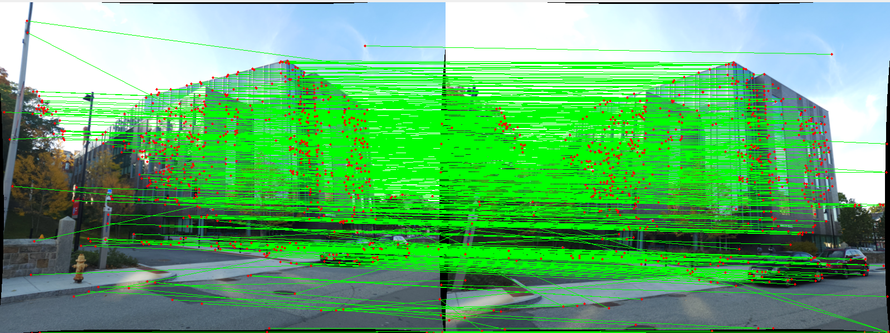
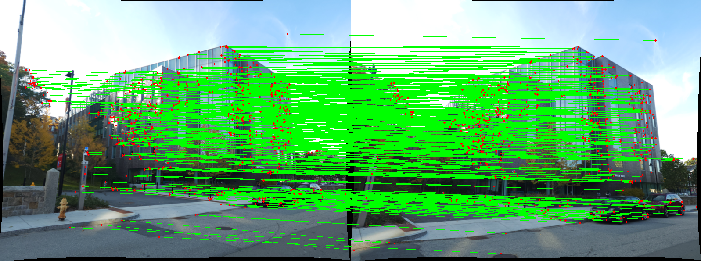
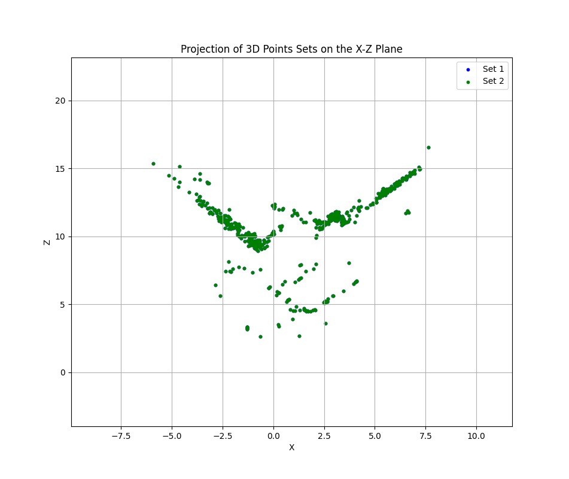
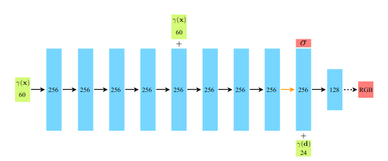
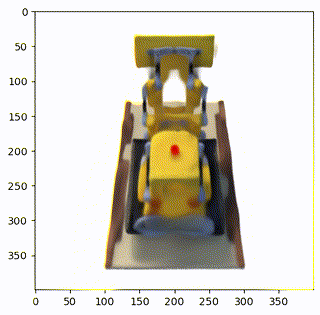
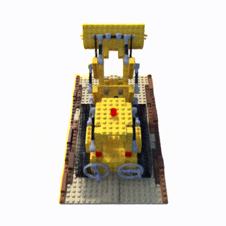

# 3D Reconstruction using Classical Structure from Motion (SfM). 

This project showcases the development of an advanced system for 3D scene reconstruction using Structure from Motion (SfM). The system processes a sequence of images to reconstruct a 3D model of a scene. 

## Methodology

Structure from Motion is a process that uses a series of 2D images to reconstruct a 3D scene. This phase involved the following steps:

- Feature Matching and Outlier Rejection with RANSAC
- Fundamental Matrix Estimation
- Essential Matrix Estimation from the Fundamental Matrix
- Camera Pose Estimation from the Essential Matrix
- Cheirality Condition Check with Triangulation
- Perspective-n-Point
- Bundle Adjustment

### Input

The dataset consists of 5 images of Unity Hall at WPI, captured using a Samsung S22 Ultra with the following settings: f/1.8 aperture, ISO 50, and 1/500 sec shutter speed. Four matching files (`matching*.txt`) detail feature correspondences between image pairs.


### Initial Feature Matching



- RANSAC results showing inliers:



- Cheirality check visualizing all possible camera poses:


- Triangulation using the correct camera pose:


- Linear Triangulation vs Non-Linear Triangular Traingulation for Set 1 and Set 2. 



- Before and After Bundle Adjustment for sets 1 and 2. 


### Usage

To run the SfM pipeline:

```bash
python3 Wrapper.py
```

# Novel View Synthesis using Neural Radiance Fields (NeRF):
Implemented the original NERF method [from this paper](https://arxiv.org/abs/2003.08934).

### Input:
Download the lego data for NeRF from the original author’s link [here](https://drive.google.com/drive/folders/1lrDkQanWtTznf48FCaW5lX9ToRdNDF1a)

#### Sample input


### Neural Network used


### Training without Positional Encoding


### Training with Positional Encoding


### Result on Test without positional encoding


### Result on Test set with positional encoding



### Usage Guidelines:

#### Training:
1. Change the directory to Phase 2.
2. To train the NeRF model on GPU:

```
python3 Wrapper,py
```
3. Output of Loss plot will be saved in Results folder.

#### Testing
1. Change the flag in the ```Wrapper.py``` script and follow the training instructions. 

