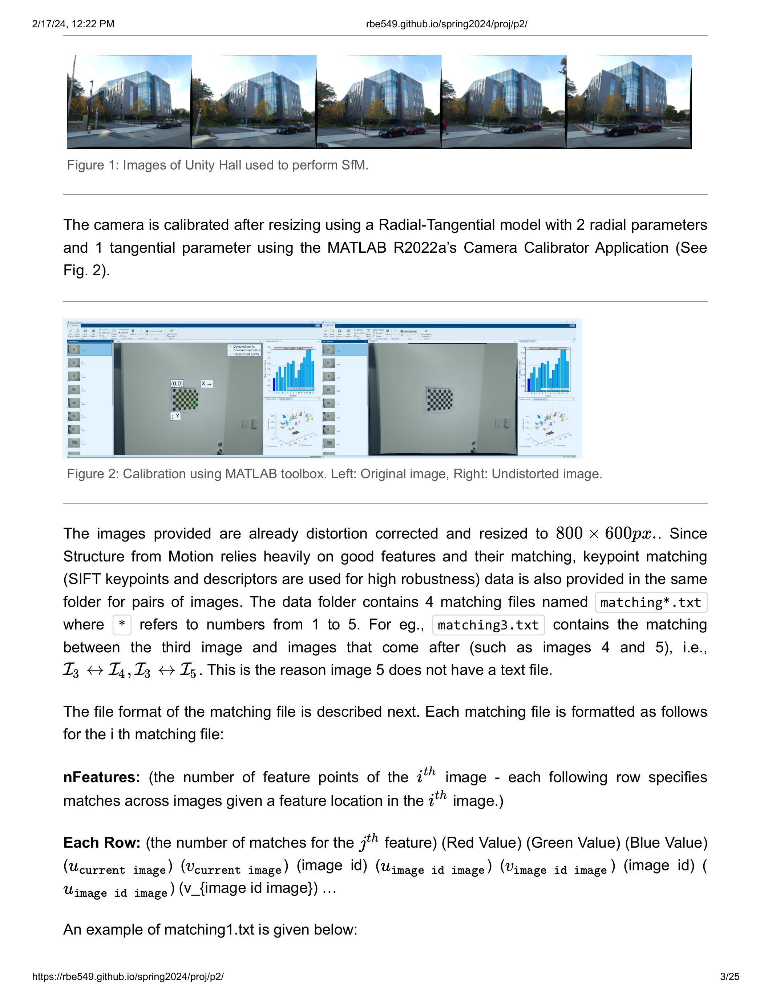

# Buildings built in minutes - Structure from Motion

# 1. Introduction 

Let’s reconstruct a 3D scene and simultaneously obtain the camera poses of a monocular
camera w.r.t. the given scene. This procedure is known as Structure from
Motion (SfM). As the name suggests, you are creating the entire rigid
structure from a set of images with different view points (or
equivalently a camera in motion). A few years ago, Agarwal et. al
published Building Rome in a Day in which they reconstructed the entire
city just by using a large collection of photos from the Internet. Ever
heard of Microsoft Photosynth? Fascinating? isn’t it!? There are a few
open source SfM algorithm available online like VisualSFM. Try them!

Let’s learn how to recreate such algorithm. There are a few steps that
collectively form SfM:

- Feature Matching and Outlier rejection using RANSAC

- Estimating Fundamental Matrix

- Estimating Essential Matrix from Fundamental Matrix

- Estimate Camera Pose from Essential Matrix

- Check for Cheirality Condition using Triangulation

- Perspective-n-Point

- Bundle Adjustment

# 2. Dataset for Classical SfM

We are going to run classical SfM algorithm on the data provided here.
The data is a set of 5 images of Unity Hall at Worcester Polytechnic Institute (See
Fig. 1), using a Samsung S22 Ultra’s primary camera at f/1.8 aperture,
ISO 50 and 1/500 sec shutter speed.

Figure 1: Images of Unity Hall used to perform SfM.

The camera is calibrated after resizing using a Radial-Tangential model
with 2 radial parameters and 1 tangential parameter using the MATLAB
R2022a’s Camera Calibrator Application (See Fig. 2).

<!--  -->

Figure 2: Calibration using MATLAB toolbox. Left: Original image, Right:
Undistorted image.

The images provided are already distortion corrected and resized to
800 × 600*p**x*.. Since Structure from Motion relies heavily on good
features and their matching, keypoint matching (SIFT keypoints and
descriptors are used for high robustness) data is also provided in the
same folder for pairs of images. The data folder contains 4 matching
files named matching\*.txt where \* refers to numbers from 1 to 5 . For
eg., matching3.txt contains the matching between the third image and
images that come after (such as images 4 and 5), i.e.,
ℐ3 ↔ ℐ4, ℐ3 ↔ ℐ5. This is
the reason image 5 does not have a text file.

The file format of the matching file is described next. Each matching
file is formatted as follows for the i th matching file:

nFeatures: (the number of feature points of the *i*th 
image - each following row specifies matches across images given a
feature location in the *i**t**h* image.)

Each Row: (the number of matches for the *j*th  feature) (Red
Value) (Green Value) (Blue Value)
(*u*current image )(*v*current image ) (image id)
( *u*image id image )(*v*image id image ) (image
id) ( *u*image  id image ) (v\_{image id image }) ...

An example of matching1.txt is given below:

nFeatures: 3930

$\begin{array}{lllllllll}2 & 255255255 & 5.08304 & 116.978 & 349.0748 & 166.783\end{array}$

$\begin{array}{llllllllllll}37971 & 51 & 7.15528 & 197.921 & 2 & 11.255 & 225.237 & 5 & 259.685 & 103.719\end{array}$

The images are taken at 4000 × 3000*p**x*. but are resized to
800 × 600*p**x*. before the camera intrinsic parameters *K* are
estimated which are given in calibration.txt file. You will program this
full pipeline guided by the functions described in following sections.

# 4. Classical Approach to the SfM problem

## 4.1. Feature Matching, Fundamental Matrix and RANSAC

We have already learned about keypoint matching using SIFT keypoints and
descriptors (Recall Project 1: Panorama Stitching). It is important to
refine the matches by rejecting outline correspondence. Before rejecting
the correspondences, let us first understand what Fundamental matrix is!

## 4.2. Estimating Fundamental Matrix

The fundamental matrix, denoted by *F*, is a 3 × 3 (rank 2) matrix that
relates the corresponding set of points in two images from different
views (or stereo images). But in order to understand what fundamental
matrix actually is, we need to understand what epipolar geometry is! The
epipolar geometry is the intrinsic projective geometry between two
views. It only depends on the cameras’ internal parameters ( *K* matrix)
and the relative pose i.e. it is independent of the scene structure.

## 4.2.1. Epipolar Geometry

Let’s say a point **X** in the 3D-space (viewed in two images) is
captured as **x** in the first image and **x**′ in the
second. Can you think how to formulate the relation between the
corresponding image points **x** and **x**′ ? Consider Fig.
2. Let **C** and **C**′ be the respective camera centers
which forms the baseline for the stereo system. Clearly, the points
**x**, **x**′ and **X** (or **C**, **C**′ and
**X** ) are

coplanar i.e.
$\overrightarrow{\mathbf{C x}} \cdot\left(\overrightarrow{\mathbf{C C}^{\prime}} \times \overrightarrow{\mathbf{C}^{\prime} \mathbf{x}^{\prime}}\right)=0$
and the plane formed can be denoted by *π*. Since these points are
coplanar, the rays back-projected from **x** and **x**′
intersect at **X**. This is the most significant property in searching
for a correspondence.

a 

b

Figure 3: Epipolar Geometry.

Now, let us say that only **x** is known, not **x**′. We know
that the point **x**′ lies in the plane *π* which is governed
by the camera baseline **C****C**′ and
$\overrightarrow{\mathbf{C x}}$. Hence the point **x**′ lies
on the line of intersection of **l**′ of *π* with the second
image plane. The line **l**′ is the image in the second view
of the ray back-projected from **x**. This line **l**′ is
called the epipolar line corresponding to **x**. The benefit is that you
don’t need to search for the point corresponding to **x** in the entire
image plane as it can be restricted to the **l**′.

-   Epipole is the point of intersection of the line joining the camera
    centers with the image plane. (see **e** and **e**′ in
    the Fig. 2(a))

-   Epipolar plane is the plane containing the baseline.

-   Epipolar line is the intersection of an epipolar plane with the
    image plane. All the epipolar lines intersect at the epipole.

## 4.2.2. The Fundamental Matrix **F**

The **F** matrix is only an algebraic representation of epipolar
geometry and can both geometrically (constructing the epipolar line) and
arithmetically. (See derivation (Page 242)) (Fundamental Matrix Song) As
a result, we obtain:
**x***i*′**T****F****x***i* = 0, where
*i* = 1, 2, …, *m*. This is known as epipolar constraint or
correspondence condition (or Longuet-Higgins equation). Since, **F** is
a 3 × 3 matrix, we can set up a homogeneous linear system with 9
unknowns:

$$\begin{gathered}
{\left\[\begin{array}{lll}
x\_{i}^{\prime} & y\_{i}^{\prime} & 1
\end{array}\right\]\left\[\begin{array}{ccc}
f\_{11} & f\_{12} & f\_{13} \\
f\_{21} & f\_{22} & f\_{23} \\
f\_{31} & f\_{32} & f\_{33}
\end{array}\right\]\left\[\begin{array}{c}
x\_{i} \\
y\_{i} \\
1
\end{array}\right\]=0} \\
x\_{i} x\_{i}^{\prime} f\_{11}+x\_{i} y\_{i}^{\prime} f\_{21}+x\_{i} f\_{31}+y\_{i} x\_{i}^{\prime} f\_{12}+y\_{i} y\_{i}^{\prime} f\_{22}+y\_{i} f\_{32}+x\_{i}^{\prime} f\_{13}+y\_{i}^{\prime} f\_{23}+f\_{33}=0
\end{gathered}$$

Simplifying for *m* correspondences,

$$\left\[\begin{array}{ccccccccc}
x\_{1} x\_{1}^{\prime} & x\_{1} y\_{1}^{\prime} & x\_{1} & y\_{1} x\_{1}^{\prime} & y\_{1} y\_{1}^{\prime} & y\_{1} & x\_{1}^{\prime} & y\_{1}^{\prime} & 1 \\
\vdots & \vdots & \vdots & \vdots & \vdots & \vdots & \vdots & \vdots & \vdots \\
x\_{m} x\_{m}^{\prime} & x\_{m} y\_{m}^{\prime} & x\_{m} & y\_{m} x\_{m}^{\prime} & y\_{m} y\_{m}^{\prime} & y\_{m} & x\_{m}^{\prime} & y\_{m}^{\prime} & 1
\end{array}\right\]\left\[\begin{array}{c}
f\_{11} \\
f\_{21} \\
f\_{31} \\
f\_{12} \\
f\_{22} \\
f\_{32} \\
f\_{13} \\
f\_{23} \\
f\_{33}
\end{array}\right\]=0$$

How many points do we need to solve the above equation? Think! Twice!
Remember homography, where each point correspondence contributes two
constraints? Unlike homography, in **F** matrix estimation, each point
only contributes one constraints as the epipolar constraint is a scalar
equation. Thus, we require at least 8 points to solve the above
homogenous system. That is why it is known as Eight-point algorithm.

With *N* ≥ 8 correspondences between two images, the fundamental matrix,
*F* can be obtained as: By stacking the above equation in a matrix *A*,
the equation *A**x* = 0 is obtained. This system of equation can be
answered by solving the linear least squares using Singular Value
Decomposition (SVD) as explained in the Math module. When applying SVD
to matrix **A**, the decomposition **U****S****V****T** would
be obtained with **U** and **V** orthonormal matrices and a diagonal
matrix **S** that contains the singular values. The singular values
*σ**i* where *i* ∈ \[1,9\], *i* ∈ ℤ, are positive and are in
decreasing order with *σ*9 = 0 since we have 8 equations for
9 unknowns. Thus, the last column of **V** is the true solution given
that *σ**i* ≠ 0∀*i* ∈ \[1,8\], *i* ∈ ℤ. However, due to noise
in the correspondences, the estimated **F** matrix can be of rank 3 i.e.
*σ*9 ≠ 0. So, to enforce the rank 2 constraint, the last
singular value of the estimated **F** must be set to zero. If *F* has a
full rank then it will have an empty null-space i.e. it won’t have any
point that is on entire set of lines. Thus, there wouldn’t be any
epipoles. See Fig. 3 for full rank comparisons for *F* matrices.

Figure 4: F Matrix: Rank 3 vs Rank 2 comparison

In MATLAB, you can use svd to solve **x** from **A****x** = 0

$$\begin{aligned}
& {\[U, S, V\]=\operatorname{svd}(A) ;} \\
& x=V(:, \text { end }) ; \\
& F=\operatorname{reshape}(x,\[3,3\])^{\prime} ;
\end{aligned}$$

To sumarize, write a function
[EstimateFundamentalMatrix.py](http://EstimateFundamentalMatrix.py) that
linearly estimates a fundamental matrix *F*, such that
*x*2*T**F**x*1 = 0. The fundamental
matrix can be estimated by solving the linear least squares *A**x* = 0.

## 4.2.3. Match Outlier Rejection via RANSAC

Since the point correspondences are computed using SIFT or some other
feature descriptors, the data is bound to be noisy and (in general)
contains several outliers. Thus, to remove these outliers, we use RANSAC
algorithm (Yes! The same as used in Panorama stitching!) to obtain a
better estimate of the fundamental matrix. So, out of all possibilities,
the **F** matrix with maximum number of inliers is chosen. Below is the
pseduo-code that returns the **F** matrix for a set of matching
corresponding points (computed using SIFT) which maximizes the number of
inliers.

Algorithm 1: Get Inliers RANSAC

Figure 5: Feature matching after RANSAC. (Green: Selected
correspondences; Red: Rejected correspondences)

Given, *N* ≥ 8 correspondences between two images,
*x*1 ↔ *x*2, implement a function
[GetInlierRANSANC.py](http://GetInlierRANSANC.py) that estimates inlier
correspondences using fundamental matrix based RANSAC.

## 4.3. Estimate Essential Matrix from Fundamental Matrix

Since we have computed the **F** using epipolar constrains, we can find
the relative camera poses between the two images. This can be computed
using the Essential Matrix, E. Essential matrix is another 3 × 3 matrix,
but with some additional properties that relates the corresponding
points assuming that the cameras obeys the pinhole model (unlike **F**
). More specifically, **E** = **K****T****F****K** where
**K** is the camera calibration matrix or camera intrinsic matrix.
Clearly, the essential matrix can be extracted from **F** and **K**. As
in the case of **F** matrix computation, the singular values of **E**
are not necessarily (1,1,0) due to the noise in **K**. This can be
corrected by reconstructing it with (1,1,0) singular values, i.e.

$\mathbf{E}=U\left\[\begin{array}{lll}1 & 0 & 0 \\ 0 & 1 & 0 \\ 0 & 0 & 0\end{array}\right\] V^{T}$

It is important to note that the **F** is defined in the original image
space (i.e. pixel coordinates) whereas **E** is in the normalized image
coordinates. Normalized image coordinates have the origin at the optical
center of the image. Also, relative camera poses between two views can
be computed using **E** matrix. Moreover, **F** has 7 degrees of freedom
while **E** has 5 as it takes camera parameters in account. (5-Point
Motion Estimation Made Easy)

Given *F*, estimate the essential matrix *E* = *K**T**F**K*
by implementing the function
[EssentialMatrixFromFundamentalMatrix.py](http://EssentialMatrixFromFundamentalMatrix.py)
.

## 4.4. Estimate Camera Pose from Essential Matrix

The camera pose consists of 6 degrees-of-freedom (DOF) Rotation (Roll,
Pitch, Yaw) and Translation (*X*,*Y*,*Z*) of the camera with respect to
the world. Since the **E** matrix is identified, the four camera pose
configurations:
(*C*1,*R*1), (*C*2,*R*2), (*C*3,*R*3)
and (*C*4,*R*4) where *C* ∈ ℝ3 is the camera
center and *R* ∈ *S**O*(3) is the rotation matrix, can be computed.
Thus, the camera pose can be written as:
$P=K R\left\[\begin{array}{ll}I\_{3 \times 3} & -C\end{array}\right\]$
These four pose configurations can be computed from **E** matrix. Let
**E** = *U**D**V**T* and
$W=\left\[\begin{array}{ccc}0 & -1 & 0 \\ 1 & 0 & 0 \\ 0 & 0 & 1\end{array}\right\]$.
The four configurations can be written as:

1.  *C*1 = *U*(:,3) and
    *R*1 = *U**W**V**T*

2.  *C*2 =  − *U*(:,3) and
    *R*2 = *U**W**V**T*

3.  *C*3 = *U*(:,3) and
    *R*3 = *U**W**T**V**T*

4.  *C*4 =  − *U*(:,3) and
    *R*4 = *U**W**T**V**T*

It is important to note that the det (*R*) = 1. If det (*R*) =  − 1, the
camera pose must be corrected i.e. *C* =  − *C* and *R* =  − *R*.

Implement the function
[ExtractCameraPose.py](http://ExtractCameraPose.py), given E.$$

## 4.5. Triangulation Check for Cheirality Condition

In the previous section, we computed four different possible camera
poses for a pair of images using essential matrix. In this section we
will triangulate the 3D points, given two camera poses.

Given two camera poses, (*C*1,*R*1) and
(*C*2,*R*2), and correspondences,
*x*1 ↔ *x*2, triangulate 3D points using linear
least squares. Implement the function
[LinearTriangulation.py](http://LinearTriangulation.py) .

Though, in order to find the correct unique camera pose, we need to
remove the disambiguity. This can be accomplished by checking the
cheirality condition i.e. the reconstructed points must be in front of
the cameras. To check the Cheirality condition, triangulate the 3D
points (given two camera poses) using linear least squares to check the
sign of the depth *Z* in the camera coordinate system w.r.t. camera
center. A 3D point *X* is in front of the camera iff:
*r*3(**X**−**C**) \> 0 where *r*3 is the third row
of the rotation matrix (z-axis of the camera). Not all triangulated
points satisfy this condition due of the presence of correspondence
noise. The best camera configuration, (*C*,*R*,*X*) is the one that
produces the maximum number of points satisfying the cheirality
condition.